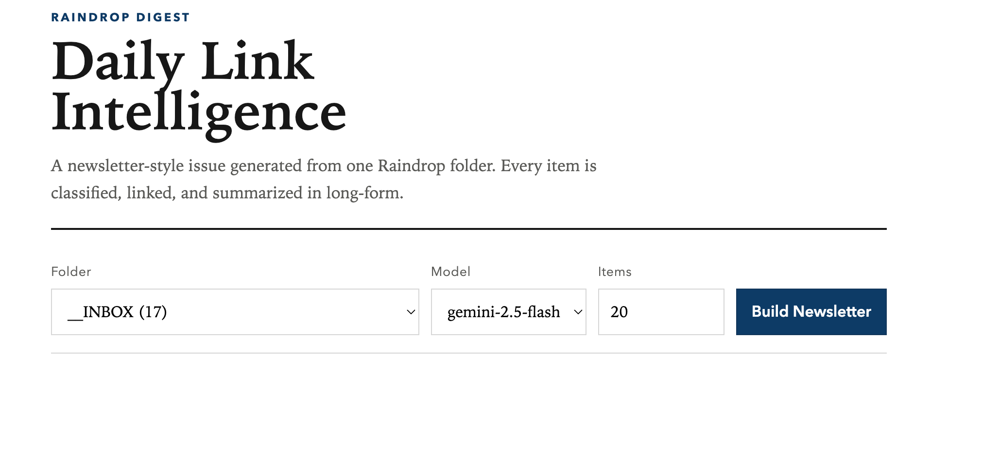
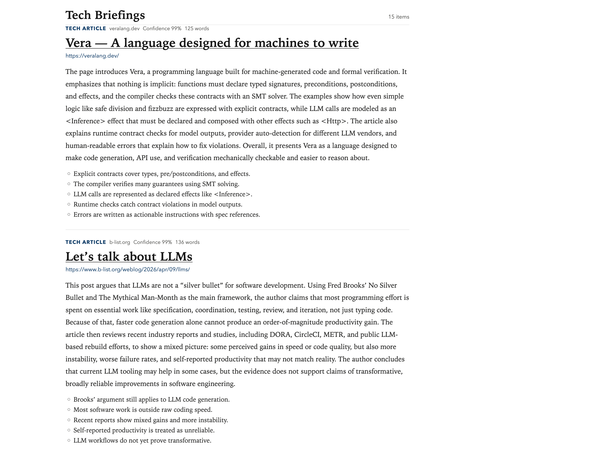
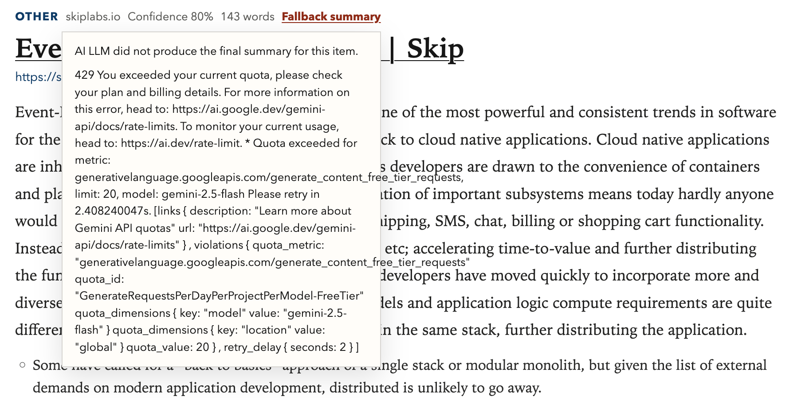

# Raindrop Summarizer


If you have a lot of bookmarks in [raindrop.io](https://raindrop.io/), Raindrop Digest` helps you get an AI powered summary of all bookmarks in a single folder of raindrop.io so that you can quickly review them instead of going through each item one by one.

Responsive  webapp for:

1. reading all links from one Raindrop.io folder, including the built-in `Unsorted` folder
2. extracting page content
3. classifying each item
4. summarizing with selectable OpenAI or Gemini models in a newsletter style

## Run locally

```bash
cp .env.example .env.local
npm install
npm run dev
```
- Update the variables in .env.local
- Open `http://localhost:3000`.

## Run with Docker

Build the image:

```bash
docker build -f dockerfile -t raindrop-digest .
```

If you plan to host the container in linux or cloud services, then build for target architectures, e.g.g
```bash
docker buildx build --platform linux/amd64,linux/arm64 -f dockerfile -t raindrop-summarizer .
```


Run the container:

```bash
docker run --rm -p 3000:3000 --env-file .env.local raindrop-digest
```

Open `http://localhost:3000`.

## Implementation plan

1. Authentication and configuration
   - Set `RAINDROP_TOKEN` in environment variables.
   - Set `LLM_PROVIDER` in `.env.local` to `openai` or `gemini`.
   - Set `LLM_MODEL` in `.env.local` to the exact model name you want to use for that provider.
   - Set `GEMINI_API_KEY` for Gemini-backed models.
   - Set `OPENAI_API_KEY` for OpenAI-backed models.
   - Set `PYTHON_BACKEND_URL` if the Next frontend should talk to a non-default backend URL.
   - Optional: `SUMMARIZE_CONCURRENCY` controls LLM call parallelism (default `2`).

2. Collection discovery
   - Use `GET /collections` and `GET /collections/childrens` from Raindrop to populate the folder picker.
   - Add the system `Unsorted` collection explicitly using Raindrop collection id `-1`.

3. Folder ingestion
   - Use `GET /raindrops/{collectionId}?page={n}&perpage=50` to fetch every bookmark in the selected folder.
   - Limit summarization to the requested number of items. Default: `20`.

4. Content extraction
   - For each saved URL, fetch the page server-side and extract readable text with `@mozilla/readability`.
      - This keeps prompts smaller and more consistent than sending raw HTML to Gemini.

5. Classification and summarization
   - Send extracted text to the selected LLM through LangChain with the chosen model determining the content type from page content.
      - The backend returns:
         - `tech_article`
         - `non_tech_article`
         - `action_item`
         - `other`

   Response format:
   - `summary`: always present and expanded to at least 150 words
   - `bullets`: key takeaways for articles, action bullets for action items
   - `confidence` and `rationale`: useful for debugging bad classifications

6. Responsive UI
   - Keep all secrets on the server.
   - Render results as a newsletter-style issue (single-column digest).
   - Read `LLM_PROVIDER` and `LLM_MODEL` from `.env.local` and expose that configured model in the frontend selector.
   - The browser calls Next API routes, and those proxy into the Python backend:
      - `GET /api/config`
      - `GET /api/collections`
      - `POST /api/summarize`

7. Production hardening (Not Implemented)
   - Add a database and background jobs if you want caching, retries, progress tracking, and historical summaries.
   - For large folders, process in a queue instead of one HTTP request.

## Sample architecture

- `app/page.tsx`
  Responsive client UI
- `app/api/collections/route.ts`
  Proxies to the Python backend
- `app/api/summarize/route.ts`
  Proxies to the Python backend
- `backend/main.py`
  FastAPI backend, Raindrop client, extraction, LangChain + provider-aware classification/summarization
- `requirements.txt`
  Python backend dependencies


## Notes

- This app uses a personal Raindrop token for server-side access.
- If `LLM_PROVIDER` is missing or invalid, the app returns a configuration error telling you to set it in `.env.local`.
- If `LLM_MODEL` is missing, the app returns a configuration error telling you to set it in `.env.local`.
- If the selected model's API key is missing or invalid, the backend returns a clear provider-specific error.
- If the selected LLM call fails after client creation, the Python backend falls back to a local long-form extractive summary and marks the rationale accordingly.
- Some pages block scraping or load content entirely in the browser. Those links may fall back to weak summaries unless you add a headless browser step.
- PDFs, videos, and non-HTML documents need separate extraction pipelines.

## Usage

1. Choose your folder and how many items do you want to review in the folder and click on `Build Newsletter`


2. Summarized items load up in newsletter styles


3. If summarization fails, click on the "Fallback Summary" link to see the reason

